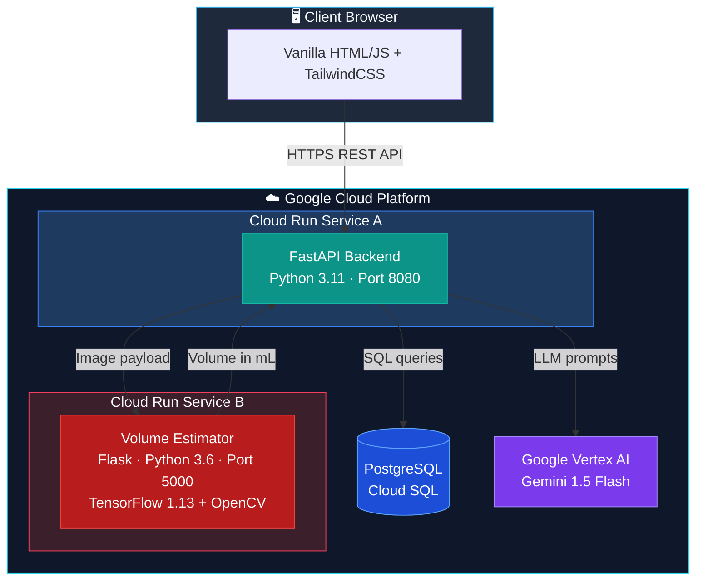
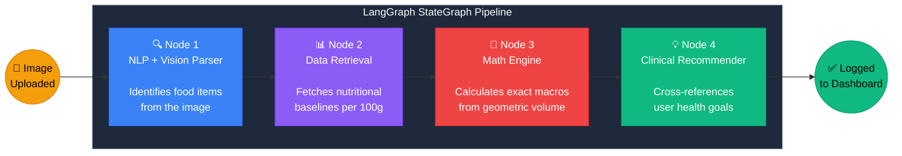
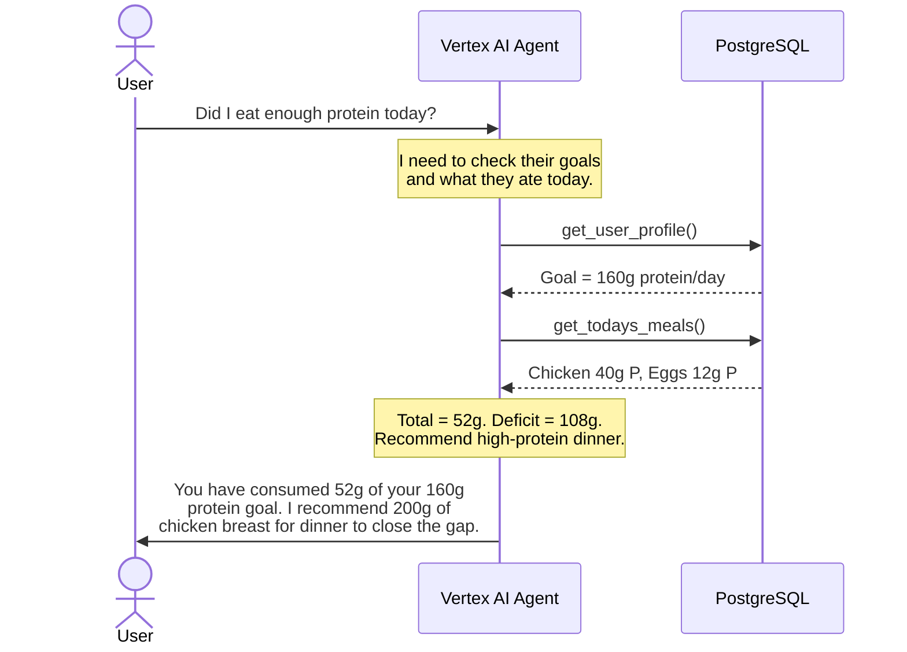
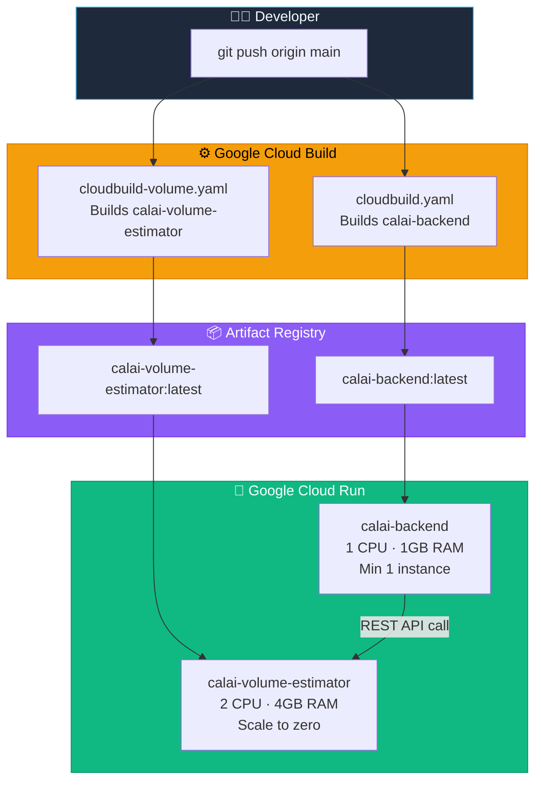

<div align="center">

  <h1>🥗 CalAi</h1>
  <h3>The Autonomous AI Clinical Sports Nutritionist</h3>

  <p>
    
    
    
    
    
    
    
    
    
    
  </p>

  <p>
    CalAi autonomously estimates meal volume from photos using computer vision,<br>
    identifies food via Google Vertex AI, calculates precise macronutrients,<br>
    and synthesizes personalized dietary advice based on your health goals.
  </p>

  <h3>
    🟢 Live at: <a href="https://calai-backend-1041961183692.asia-south1.run.app">https://calai-backend-1041961183692.asia-south1.run.app</a>
  </h3>

</div>

---

## 📑 Table of Contents

- [Key Features](#-key-features)
- [System Architecture](#-system-architecture)
- [The Agentic AI Pipeline](#-the-agentic-ai-pipeline)
- [The Autonomous Chatbot](#-the-autonomous-chatbot)
- [Project Structure](#-project-structure)
- [Tech Stack](#-tech-stack)
- [Deployment Infrastructure](#-deployment-infrastructure)
- [Local Development Setup](#-local-development-setup)
- [License](#-license)

---

## 🌟 Key Features

| Feature | Description |
|---------|-------------|
| **📸 Geometric Volume Estimation** | Uploads are routed to an isolated CV microservice running TensorFlow Mask R-CNN and monocular depth estimation to calculate exact food volume in mL. |
| **🤖 4-Node Agentic Pipeline** | A LangGraph `StateGraph` pipeline — Vision → Data Retrieval → Math Engine → Clinical Recommender — ensures accurate, hallucination-resistant macronutrient calculations. |
| **🔐 Google OAuth 2.0** | Secure sign-in via Google. JWTs are verified server-side and issued as strict `HttpOnly` + `Secure` session cookies — tokens never touch LocalStorage. |
| **💬 Autonomous Chatbot** | An AI nutritionist powered by Vertex AI Native Function Calling. It actively queries your database for your goals and today's meals before answering. |
| **🚀 Dual Microservices** | Two independent Docker containers on Cloud Run: a modern Python 3.11 FastAPI backend and a legacy Python 3.6 TensorFlow CV service, fully isolated. |
| **📊 Smart Dashboard** | Real-time macro tracking with animated progress rings, daily caloric summaries, and AI-generated health insights. |

---

## 🏗️ System Architecture

CalAi is built on a decoupled **Microservices Architecture** deployed entirely on Google Cloud Platform.



---

## 🧠 The Agentic AI Pipeline

When a user uploads a food photo, it doesn't just go to a chatbot. It enters a **4-Node LangGraph `StateGraph`** — a deterministic, sequential pipeline that breaks the problem into specialized stages to eliminate LLM hallucinations.



**How each node works:**

| Node | File | Role |
|------|------|------|
| **Node 1** | `node1_nlp.py` | Sends the image to Vertex AI Gemini with a structured prompt. Returns the food name, estimated serving description, and parsed quantities. |
| **Node 2** | `node2_data.py` | Retrieves standard nutritional baselines — calories, protein, carbs, fat per 100g — from the database or via live data retrieval. |
| **Node 3** | `node3_math.py` | Constrains the LLM to perform strict arithmetic: `macros = baseline_per_100g × (volume_ml × density / 100)`. No guessing allowed. |
| **Node 4** | `node4_recommender.py` | Loads the user's health profile from PostgreSQL and generates a personalized clinical recommendation comparing the meal against their daily targets. |

The pipeline state flows through a Pydantic `GraphState` schema:

```python
class GraphState(BaseModel):
    user_input: str
    image_base64: Optional[str] = None
    parsed_query: Optional[Dict] = None       # Output of Node 1
    profile: Optional[Dict] = None            # Output of Node 2
    calculated_nutrition: Optional[Dict] = None  # Output of Node 3
    recommendations: Optional[str] = None      # Output of Node 4
```

---

## 💬 The Autonomous Chatbot

The chatbot isn't a passive Q&A — it's an **autonomous agent** powered by Vertex AI Native Function Calling. When it lacks context, it actively calls tools to fetch data before responding.



---

## 📂 Project Structure

```
CalAi/
├── 📄 Dockerfile                  # Main backend container (Python 3.11)
├── 📄 Dockerfile.volume           # Volume estimator container (Python 3.6)
├── 📄 cloudbuild.yaml             # CI/CD pipeline for the backend
├── 📄 cloudbuild-volume.yaml      # CI/CD pipeline for the volume estimator
├── 📄 docker-compose.yml          # Local dev orchestration
├── 📄 requirements.txt            # Backend Python dependencies
├── 📄 config.py                   # App configuration
│
├── 📁 src/
│   ├── 📁 backend/
│   │   ├── 📄 main.py             # FastAPI app — all routes, auth, sessions
│   │   ├── 📄 setup_db.py         # PostgreSQL schema initialization
│   │   ├── 📁 agents/
│   │   │   ├── 📄 schema.py               # Pydantic GraphState model
│   │   │   ├── 📄 langgraph_pipeline.py    # StateGraph builder + runner
│   │   │   ├── 📄 node1_nlp.py            # Vision + NLP food identification
│   │   │   ├── 📄 node2_data.py           # Nutritional data retrieval
│   │   │   ├── 📄 node3_math.py           # Macro calculation engine
│   │   │   └── 📄 node4_recommender.py    # Personalized clinical advice
│   │   └── 📁 database/                   # DB connection utilities
│   │
│   ├── 📁 frontend/
│   │   ├── 📁 login/                      # Google OAuth + demo mode
│   │   ├── 📁 nutriflow_dashboard/        # Main dashboard with macro rings
│   │   ├── 📁 ai_nutrition_scanner/       # Food photo upload + AI analysis
│   │   ├── 📁 nutriflow_chat/             # Autonomous AI chatbot
│   │   ├── 📁 meal_history_logs/          # Historical meal log viewer
│   │   ├── 📁 profile_health_goals/       # User profile + health targets
│   │   └── 📁 vitality_core/              # Settings + additional features
│   │
│   └── 📁 volume_estimator/
│       ├── 📄 app.py                      # Flask API wrapper
│       ├── 📄 volume_estimator.py         # Core CV + depth estimation logic
│       ├── 📄 point_cloud_utils.py        # 3D point cloud volume computation
│       ├── 📁 depth_estimation/           # Monocular depth model
│       ├── 📁 food_segmentation/          # Mask R-CNN food segmentation
│       └── 📁 ellipse_detection/          # Plate ellipse fitting
│
├── 📁 models/                             # Pre-trained ML weights (~450MB)
│   ├── monovideo_fine_tune_food_videos.h5
│   ├── monovideo_fine_tune_food_videos.json
│   └── mask_rcnn_food_segmentation.h5
│
├── 📁 datasets/                           # Nutritional reference data
└── 📁 assets/                             # Static assets
```

---

## 🛠️ Tech Stack

### Backend
| Technology | Purpose |
|------------|---------|
| **FastAPI** | High-performance async Python 3.11 web framework. Serves the frontend, handles API routes, and manages session authentication. |
| **LangGraph** | Orchestrates the 4-node `StateGraph` pipeline with deterministic edges and Pydantic-validated state transitions. |
| **PostgreSQL** | Primary relational datastore for user profiles, health goals, and historical meal logs. |
| **psycopg2** | PostgreSQL database driver for executing parameterized SQL queries. |

### Volume Estimator Microservice
| Technology | Purpose |
|------------|---------|
| **Flask** | Lightweight Python 3.6 web server exposing the CV pipeline as a REST API. |
| **TensorFlow 1.13** | Runs the monocular depth estimation model to infer pixel-level depth maps from a single 2D image. |
| **OpenCV** | Image preprocessing, contour detection, and food region masking. |
| **Mask R-CNN** | Instance segmentation model trained on food datasets to isolate individual food items from the plate. |
| **scikit-image** | Advanced image processing for ellipse detection and plate boundary fitting. |

### Frontend
| Technology | Purpose |
|------------|---------|
| **Vanilla HTML/JS** | Zero-framework frontend for maximum speed. DOM manipulation via native JS `fetch()` API calls. |
| **Tailwind CSS** | Utility-first CSS framework for the glassmorphic, premium dark-mode UI. |

### Cloud Infrastructure
| Technology | Purpose |
|------------|---------|
| **Google Cloud Run** | Serverless container hosting. Auto-scales from 0 to N instances. Two services: `calai-backend` and `calai-volume-estimator`. |
| **Google Vertex AI** | Enterprise-grade LLM API. Gemini 1.5 Flash powers both the agentic pipeline and the chatbot. |
| **Google Cloud Build** | CI/CD. Builds Docker images, pushes to Artifact Registry, and deploys to Cloud Run on every `git push`. |
| **Google Artifact Registry** | Private Docker image repository in `asia-south1`. |
| **Google OAuth 2.0** | Secure user authentication via Google accounts. |

---

## ☁️ Deployment Infrastructure

CalAi runs on **two independent Google Cloud Run services** deployed via automated CI/CD pipelines.



| Service | Image | CPU | Memory | Scaling | Region |
|---------|-------|-----|--------|---------|--------|
| `calai-backend` | `calai-repo/calai-backend:latest` | 1 vCPU | 1 GB | Min 1, Max 5 | `asia-south1` |
| `calai-volume-estimator` | `calai-repo/calai-volume-estimator:latest` | 2 vCPU | 4 GB | Min 0, Max 3 | `asia-south1` |

> **Why scale-to-zero for the Volume Estimator?** The heavy ML models are only needed when a user actively scans a meal. By scaling to zero at idle, we avoid burning GCP credits 24/7 on a 4GB container.

---

## 👨‍💻 Local Development Setup

### Prerequisites
- Docker & Docker Compose
- Python 3.11+
- A Google Cloud project with Vertex AI enabled

### 1. Clone the Repository
```bash
git clone https://github.com/kavyajshah240706/CalAi.git
cd CalAi
```

### 2. Configure Environment Variables
Create a `.env` file in the root directory:
```env
# Google Cloud Vertex AI
GOOGLE_APPLICATION_CREDENTIALS=path/to/your/service-account-key.json

# Database
DATABASE_URL=postgresql://postgres:postgrespassword@db:5432/calai_db

# Volume Estimator Microservice
VOLUME_ESTIMATOR_URL=http://volume_estimator:5000
```

### 3. Run with Docker Compose
Spin up all three services — PostgreSQL, FastAPI backend, and Volume Estimator — with one command:
```bash
docker-compose up --build
```

### 4. Access the App
Open your browser and navigate to:
```
http://localhost:8000
```

---

## 📄 License

This project is licensed under the [MIT License](LICENSE).

---

<div align="center">
  <sub>Architected with ❤️ for precision nutrition tracking.</sub>
</div>
